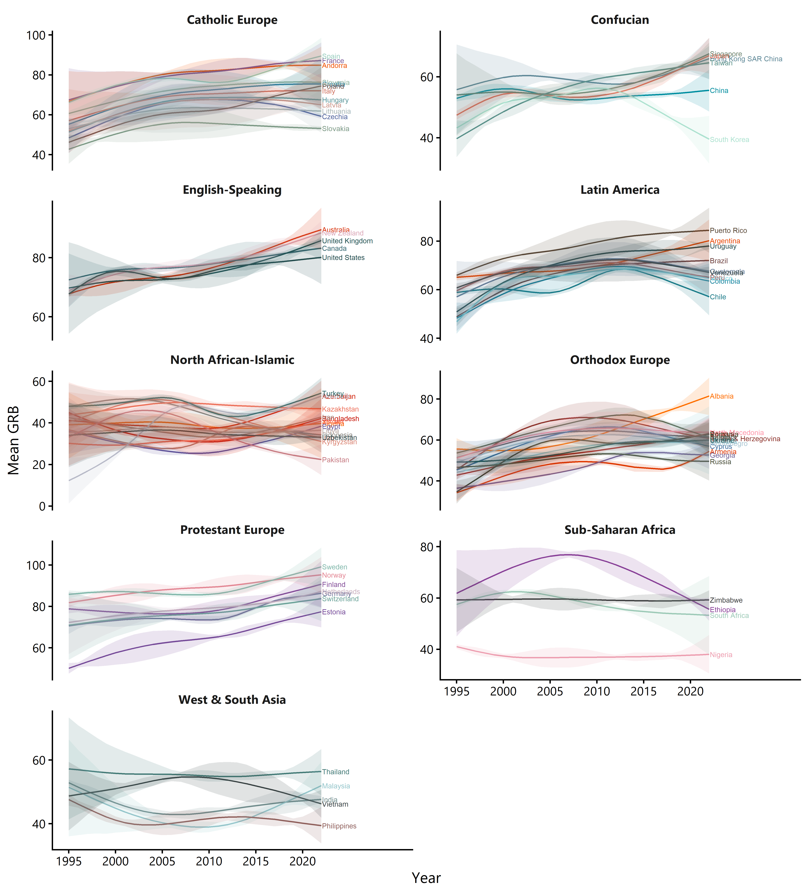
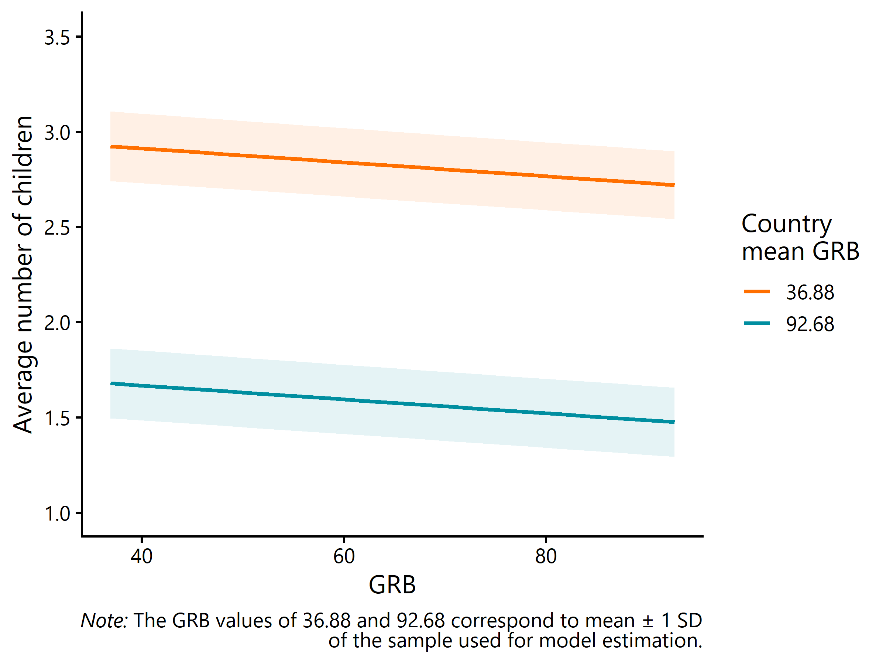
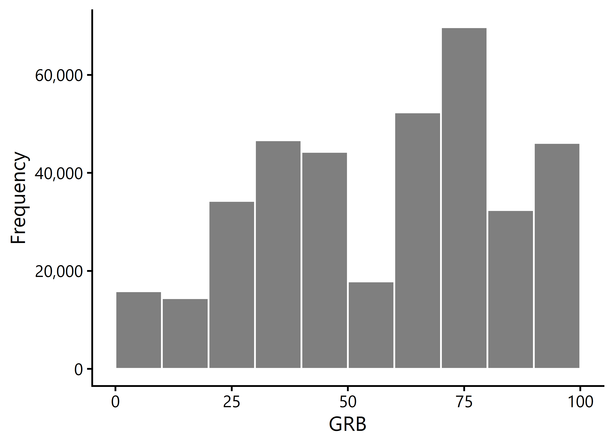
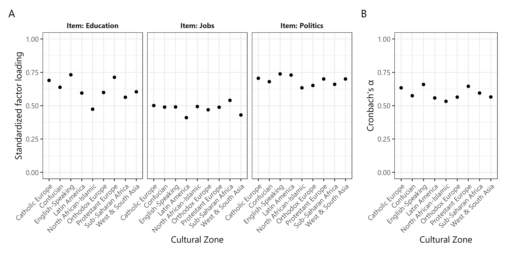
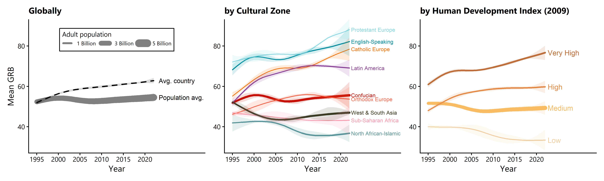

```{r setup, include=FALSE}
# config
library(tidyverse)
library(knitr)
library(kableExtra)
source("../R/functions.R")
knitr::opts_chunk$set(echo = FALSE, warning = FALSE, message = FALSE, 
                      fig.align = "center", table.placement = "H", fig.pos = "H")

# import and pre-compute results objects
m <- readRDS("../results/intermediate/m_hgam.rds")
nobs <- format(nrow(m$model), big.mark = ",")
nctr <- length(unique(m$model$country))
ncul <- length(unique(m$model$culzone))
nyrs <- length(unique(m$model$year_s))
zones <- as.character(sort(unique(m$model$culzone)))
tab_asfrsample <- readRDS("../results/TabSM_asfrsample.rds")
nobs_asfr <- format(sum(as.numeric(sub("\\s*\\(.*", "", tab_asfrsample$`Sample size`))), big.mark = ",")
tab_asfrpostpars <- readRDS("../results/TabSM_asfrpostpars.rds")
tab_asfrpostcors <- readRDS("../results/TabSM_asfrpostcors.rds")
m_s <- readRDS("../results/intermediate/m_hgam_s.rds")
asfrfit <- readRDS("../results/intermediate/asfrmodel.rds")
```

\pagebreak

\newpage \pagenumbering{arabic} \setcounter{page}{1}

# Country-specific trends in mean GRB {#sm1}

Figure \ref{fig:grbtrends} shows the estimated time trends in mean gender role beliefs (GRB) for all `r nctr` countries included in the longitudinal analysis, with one panel for each cultural zone. These estimates were obtained from the hierarchical generalized additive model (HGAM) with post-stratification on age and sex groups (see \ref{sm5hgam}).

```{r grbtrends, fig.cap="Estimated mean GRB over time of the populations of different countries from the HGAM with post-stratification (point estimate is the posterior mean) with pointwise 90% equal-tailed credible intervals.", out.width="100%"}

```

\pagebreak

In Figures \ref{fig:grb1} to \ref{fig:grb9}, we plot these estimated longitudinal trends of mean national population GRB one-by-one and together with the raw (unweighted) national survey sample means. It can be seen that the HGAM with post-stratification delivers estimates mostly indistinguishable from the sample means in years where there is a survey, but provides flexible inter- and extrapolation with shrinkage towards the cultural zone average trend when there is no survey -- along with a substantial increase in uncertainty.

```{r all-figures-grb, echo=FALSE, results='asis'}
fig_files <- list.files("../results", pattern = "^FigSM_countries", full.names = TRUE)
for (i in 1:length(fig_files)){
  width <- "100%"
  cat("\n")
  cat("![\\label{fig:grb", i, "}Estimated mean GRB over time of the populations of countries in the cultural zone *", zones[i], "*. Lines are estimates (posterior means) from the HGAM with post-stratification. Pointwise 50%, 80%, and 90% equal-tailed credible intervals are shown in purple. Points are sample means in the survey wave and year noted above each point.](", fig_files[i], "){width=", width, "}\n", sep = "")
}
```

\clearpage

# Association of GRB and number of children {#sm2}

Figure \ref{fig:lmm} shows the estimated effects of an individual woman's GRB (horizontal axis) and of the mean GRB among women in the same country (colored lines) on number of children reported in the survey, obtained in the linear mixed-effects model (LMM; see \ref{sm5lmm}) reported as Model 1 in Table 1 in the main text. The model included only the most recent survey per country, but not older than year 2010. For the figure, effects were back-transformed to the original predictor scale (0-100), values for the random intercept and slope were set to zero, and the value of the only other fixed-effect predictor (age) was set to the sample mean (zero on the standardized scale). 

The figure allows us to compare the effect of a two-standard-deviation (SD) increase in GRB *within* countries and *between* countries. The between-country effect is markedly larger. Both effect estimates should be interpreted as mere associations, produced by causal processes outside the scope of this study. Results from Models 2 and 3 in Table 1 in the main text demonstrate examples for plausible variables to which some of the covariation could be attributed (e.g., education, religiosity). Note also that the estimated SD in number of children between countries *unexplained* by GRB is comparable in size with the between-country effect of a one SD increase in GRB (see Table 1 in the main text). Hence, there are factors operating on the country level unrelated to GRB that also contribute substantially to variation in (our proxy of) completed cohort fertility.

```{r lmm, fig.cap="Estimated average number of children as a function of a woman's GRB (horizontal axis) and the sample mean GRB of women in her country (colored lines) with pointwise 90% confidence intervals. Results are based on a linear mixed-effects model that includes random country intercepts and slopes.", out.width="70%"}

```

\pagebreak

# Country-specific cumulative age-specific fertility rates {#sm3}

With our Bayesian hierarchical period age-specific fertility rate (ASFR) model, we estimated a country's fertility curve for the recent period (the most recent survey per country, but not older than year 2010; 101 countries). The model assumed that observed numbers of children for women in the population (18-49 years) resulted from a Poisson process, the expectation of which was the cumulated ASFR up until a woman's current age. For more details, see \ref{sm5asfr}. In Figures \ref{fig:asfr1} to \ref{fig:asfr9}, observed numbers of children are plotted against the fitted cumulative ASFR (posterior mean) for the two subpopulations of women with *less egalitarian* GRB (equal to or lower than the global sample median of $66.67$) and *more egalitarian* GRB (higher than the global sample median of $66.67$) for all countries. This provides an informal way to assess model fit. Another way to read the figures is that the line represents the area under the fertility curve. For the figures, the observed numbers of children were averaged if there was more than one woman sampled for a certain country, subpopulation, and age (point size indicates sample size). The year in parentheses is the year in which the data were collected, i.e., in which the country was last surveyed. For each cultural zone in the sample, one figure is shown.

```{r all-figures-asfr, echo=FALSE, results='asis'}
fig_files <- list.files("../results", pattern = "^FigSM_asfr", full.names = TRUE)
for (i in 1:length(fig_files)){
  width <- if(grepl("FigSM_asfr5", basename(fig_files[i]))) "85%" else "100%"
  cat("\n")
  cat("![\\label{fig:asfr", i, "}Estimated cumulative age-specific fertility rate (ASFR) of countries in the cultural zone *", zones[i], "*. Lines are fits from the Bayesian hierarchical ASFR model (posterior means). Points are (averages of) observed number of children among women surveyed in the country and year noted above each panel.](", fig_files[i], "){width=", width, "}\n", sep = "")
}
```

\clearpage

# Country-specific demographic effects on GRB {#sm4}

The HGAM, which was the basis for estimating the country-specific time trends in mean GRB shown in \ref{sm1}, also included fixed effects and country-varying random intercepts for the six demographic subgroups that result from interacting the age categories \{18-34 years; 35-59 years; 60+ years\} with the sex categories \{male, female\}. In section \ref{sm5hgam}, the model is described in more detail. Figure \ref{fig:icepts} visualizes between-country variation in terms of the estimated random intercepts, varying around the estimated fixed average effects. Strongly outlying countries are labelled. For example, young South Korean women are estimated to be more gender egalitarian compared to the average woman in their age group, whereas old South Korean men are estimated to be less gender egalitarian compared to the average man in their age group. The country-varying, time-constant demographic subgroup effects in Figure \ref{fig:icepts} represent the strata effects used for post-stratification (see \ref{sm5hgam}).

```{r icepts, fig.cap="Estimated average and country-specific effects of demographic subgroups on average GRB, relative to the reference category.", out.width="95%"}
include_graphics("../results/FigSM_demcoefs.png")
```

# Additional methodological details {#sm5}

## Measurement of GRB

**Measure construction**

The GRB variable was an index of three component items from the World Values Survey and European Values Study (WEVS). For each item separately, responses were assigned equidistant scores in the range 0-100, with 0 as the lower and 100 as the upper end of the response scale (min-max normalization). Higher values indicated more gender egalitarian beliefs. The arithmetic mean of the three item scores per respondent was taken as the respondent's observed level of GRB. Respondents and surveys were only included in the study if none of the three items was missing.^[Other survey projects we considered for extending the data set, like the *Pew Research Global Attitudes & Trends Survey* or the *Afrobarometer*, contained only a single analogous item (women's right to a job) and could hence not be included in our study.] Below, we provide the original item wordings and their scoring^[Scores shown here are rounded to two digits, but we used exact fractions in all calculations.] [see also, e.g., @akaliyski_distinct_2023; @welzel_freedom_2013]:

- **Item: Education.** For each of the following statements I read out, can you tell me how much you agree with each. Do you agree strongly, agree, disagree, or disagree strongly? A university education is more important for a boy than for a girl.

    *Strongly disagree (100) / Disagree (66.67) / Agree (33.33) / Agree strongly (0)*

- **Item: Jobs.** Do you agree, disagree or neither agree nor disagree with the following statements? When jobs are scarce, men should have more right to a job than women.

    *Disagree (100) / Neither (50) / Agree (0)*
    
- **Item: Politics.** For each of the following statements I read out, can you tell me how much you agree with each. Do you agree strongly, agree, disagree, or disagree strongly? On the whole, men make better political leaders than women do.

    *Strongly disagree (100) / Disagree (66.67) / Agree (33.33) / Agree strongly (0)*
    
The distribution of GRB in the global sample used for fitting the HGAM (`r nobs` respondents from `r nctr` countries surveyed between 1995 and 2022) is visualized in Figure \ref{fig:hist}. In the same sample, which pools individual responses across countries and survey waves, standardized Cronbach's $\alpha$ for the measure comprised of the three items was estimated as $0.66$. @akaliyski_distinct_2023 reports results from a principal component analysis of these items on the country level, suggesting the presence of a single component.

```{r hist, fig.cap="Distribution of GRB in the global sample used for fitting the HGAM.", out.width="55%"}

```

**Measurement properties across cultural zones**
 
We relied on individuals' scores on the GRB measure when estimating our quantities of interest (e.g., global or group-specific trends in mean GRB, or fertility differences among women with different levels of GRB). Accordingly, the assumption that persons from different regions or times understand the same item in an (approximately) equivalent way and assign it the same meaning is important. For this reason, we used a measure that had already been established in cross-cultural research, and we also examined some measurement properties across cultural zones as a way of re-validation.

The construction of the GRB variable (see above) mimicked the three-item *Equality* index that @welzel_freedom_2013[p. 71] proposed as a component of the higher-level construct of *Emancipative Values*.^[The three-item index is also a pre-computed variable in the World Values Survey data set [@wvs2024allrounds].] Its reliability and validity were extensively discussed by @welzel_freedom_2013. Previous research has relied on the same measure when analyzing perceptions/norms on gender equality. This includes, for example, research in the fields of cross-cultural psychology [e.g., @akaliyski_distinct_2023; @welzel_freedom_2013], education [e.g., @eriksson_relation_2020], or economics [e.g., @fike2024economic]. In an empirical analysis of cross-cultural measurement invariance, @sokolov_index_2018 indeed concluded for two of the three component items that they might function "cognitively equivalent across different cultures". 

We can also examine measurement properties across cultural zones in our global sample used for fitting the HGAM, which pools individual responses across countries and survey waves. Figure \ref{fig:measure}A presents estimates of standardized factor loadings from a multi-group confirmatory factor analysis (CFA) on the three items using the `lavaan` package [@rosseel_lavaan_2012]. Model parameters were not constrained across groups, which, in the measurement invariance literature, is also called the *configural model* specification [e.g., @bratt_benefits_2025]. Figure \ref{fig:measure}B presents Cronbach's $\alpha$ estimates. No re-weighting or other adjustments were applied to the sample during analyses.

```{r measure, fig.cap="Estimates of measurement properties of the GRB index for all cultural zones.", out.width="100%"}

```

Standardized factor loadings for all items and cultural zones were $\geq 0.4$, a cutoff usually taken to suggest that "the indicator is meaningfully related to a [...] factor" [@brown_confirmatory_2015, p. 27]. The majority of estimates were $\geq 0.6$. The item on women's right to a job generally loaded more weakly onto the factor than the other two items. Variation between groups in factor loading was largest for the item on importance of university education for girls. Cronbach's $\alpha$ estimates for all cultural zones were generally similar and $\geq 0.5$, but none exceeded $0.7$. They indicated a modest internal consistency of the scale.

Figure \ref{fig:measure} suggests the presence of some cross-cultural heterogeneity in measurement, but generally estimates were in the same ballpark across cultural zones. Hence, the measure appeared to function similarly across groups. 

We provide this coarse exploration of so-called *metric measurement invariance* [e.g., @boer_detecting_2018-1; @sokolov_index_2018] as background information for our study. The value of strict measurement invariance testing via the latent variable approach of CFA has been debated for cross-cultural research [e.g., @bratt_benefits_2025; @kusano_mismeasure_2025; @welzel_misconceptions_2016; @welzel_non-invariance_2023; @zhirkov_rethinking_2024]. This concerns in particular constructs that are to some degree intended to be *formative*, i.e., that are designed to emerge from the combination of partially complementary (rather than necessarily correlated) items [@welzel_misconceptions_2016; @welzel_non-invariance_2023]. As an alternative means of validation of measurement, the *nomological* approach considers how the measure is empirically associated with external variables that it should theoretically be related to [@kusano_mismeasure_2025; @minkov_comparative_2024; @welzel_non-invariance_2023]. For our three-item measure, for example, high country-level correlations with a democracy measure focused on citizen and human rights [@welzel_freedom_2013; @sokolov_index_2018], a measure of economic freedom [@fike2024economic], or a measure of reproductive freedom values [@akaliyski_distinct_2023] have been reported. 

\pagebreak

## The HGAM and post-stratification {#sm5hgam}

**General approach**

To estimate a smooth effect of time on average GRB per country, at the heart of all our longitudinal analyses was a HGAM [@pedersenHierarchicalGeneralizedAdditive2019] fit with the `mgcv` package v1.9-4 [@wood_generalized_2017] in `R` v4.5.2 [@r_core_team_r_2025], followed by representativeness adjustments via post-stratification. The approach helps in the face of typical challenges when analyzing panels of survey waves where a smooth continuous time trend in public opinion is of ultimate interest, but survey waves are scattered across years and countries in an unbalanced fashion, and might exhibit sampling bias to different degrees [@kolczynska_modeling_2024]. As an example, @fike2024economic analyzed country-level trends in our measure of GRB (which she called "Gender Social Norms Index") and noted the challenges with differential timing and coverage of surveys, making it "difficult to determine how norms have changed over time" (p. 14) based on the raw data alone.

We set the model up in a way that, when no survey sample was available for a country in a given year, information on the average level of GRB was borrowed between neighboring countries in cultural space, as well as within-countries across time, associated with an increase in uncertainty reflected in estimated variances.^[Note that, compared to some previous related work [@claassenEstimatingSmoothCountry2019; @soltModelingDynamicComparative2020; @kolczynska_modeling_2024; @kolczynskaModelingPublicOpinion2024], we did not specify a latent trait model or item response theory model, but a simple Gaussian model. The former are particularly helpful when item phrasing and response options are also heterogeneous across surveys in a relevant way, which was not the case in our data set.] Further, by relying on external, annual census data for post-stratification, changes in adult population composition that would affect mean GRB (e.g., women typically have more egalitarian views on gender-related topics, see Figure \ref{fig:icepts}) were also captured -- even when no new survey data were collected in that year.

Our HGAM of the "GS" type [see nomenclature from @pedersenHierarchicalGeneralizedAdditive2019] has the advantage of being very flexible and allowing for any shape of the individual (here, country-specific) mean GRB trajectories over time. In essence, "fitted curves interpolate the data, but there is a high level of uncertainty about the true trajectory between the data points" [@ogden_flexible_2024, p. 2]. This is seen in the credible intervals in Figure \ref{fig:grbtrends}, which widen substantially in time periods with no survey coverage, but become extremely narrow in surveyed years. Note that this uncertainty is propagated through our whole analysis. A weakness of the model is that it does not exploit structural similarities in the shape of the time effect between countries [@ogden_flexible_2024].

We believe that the method (HGAM with post-stratification) provided plausible country-specific estimates of the trend in population mean GRB, together with a principled quantification of statistical uncertainty (Figure \ref{fig:grbtrends}). In particular, the method is a potential alternative to more crude approaches sometimes applied to longitudinal, multi-country survey data sets. This might include last-observed-value-carried-forward imputation, linear interpolation, or a reduction of the sample to only countries with very frequent survey coverage (which hardly leads to data sets allowing conclusions about global trends). We view our method as extending the toolbox to estimate long-term attitudinal change in the global population from WEVS and similar survey data sets. For other approaches -- some more, some less model-based -- see, for example, @anderson_humanitys_2021 or @foa2022future.^[In an early phase of our study, we also analyzed the global and cultural zone-specific trajectories of population mean GRB with a method closely following @foa2022future: We restricted the data set to countries with at least a 15-year span of available data, always entered the mean GRB estimate of the most recent available survey in each year for each country, and computed annual global averages weighted by national population sizes. Results were qualitatively very similar, but they were based on a smaller set of countries (i.e., smaller share of the global population), they exhibited some unrealistic "jumps" in the longitudinal profiles, and did not provide a straightforward way to inspect statistical uncertainty.]

To avoid too excessive extrapolation, countries were only included in the sample of the longitudinal analysis when they had $\geq2$ national WEVS surveys between 1995 and 2022, and these spanned at least a quarter of the observation period (i.e., they were at least 7 years apart). Since two of the three items were introduced into questionnaires only with wave 3 of the World Values Survey (WVS), no older data could be used. The `r nctr` included countries^[For simplicity, "countries" refers to all surveyed entities, including territories and other political units.] made up $86.1\%$ of the world's adult (18+ years) population in 2022. The resulting sample for model estimation is described in Table \ref{tab:survs}. It contained $n =$ `r nobs` respondents with non-missing entries for all variables, originating from `r nctr` countries in `r ncul` cultural zones, belonging to 6 age-sex groups and having been surveyed in `r nyrs` distinct years.^[For wave 7 of the WVS (official time frame 2017--2022), we set the observed year for India to 2022, although India's national survey was completed only in July 2023. India was the only country in the data set surveyed after 2022. This manipulation allowed us to include recent data from a large share of the adult world population without having to estimate a (highly uncertain) 2023 population mean for all `r nctr-1` other countries.]


```{r survs, tab.cap="Sample sizes per country and survey year in the sample used for fitting the HGAM."}
tab_surv <- m$model %>% 
  mutate(year = as.numeric(round(unscale(year_s,  
                                         center = attr(m$model$year_s, "scaled:center"), 
                                         scale = attr(m$model$year_s, "scaled:scale")))),
         country = as.character(country)) %>% 
  group_by(country, year) %>% 
  summarise(n = n(), .groups = "drop_last") %>% 
  mutate(n = format(n, big.mark = ",", trim = TRUE)) %>% 
  summarise(year_n = paste(paste0(year, " (", n, ")"), collapse = "; ")) %>% 
  rename(Country = country,
         "Year (sample size)" = year_n)

colrows <- ceiling(nrow(tab_surv)/2)
tab1 <- tab_surv[1:min(colrows, nrow(tab_surv)), ]
tab2 <- tab_surv[(colrows + 1):nrow(tab_surv), ]
max_rows <- max(nrow(tab1), nrow(tab2))

empty_rows <- data.frame(matrix("", max_rows - nrow(tab2), ncol(tab2)))
colnames(empty_rows) <- colnames(tab2)
tab2 <- rbind(tab2, empty_rows)

kable(cbind(tab1, tab2), booktabs = TRUE, 
      linesep = c("")) %>%
  kable_styling(latex_options = c("scale_down", "hold_position")) %>%
  column_spec(2, border_right = TRUE) %>%
  row_spec(0, bold = TRUE)
```

In a sensitivity analysis, we applied stricter sample inclusion criteria: A country was only part of the longitudinal analysis if it had $\geq3$ national surveys that jointly covered at least half of the observation period (i.e., 14 years). Results of the sensitivity analysis are presented in \ref{sm6}.

\pagebreak

**Model definition and fitting**

Denote by $y_{i}$ the GRB of person $i$, by $j[i]$ the country of the $i$th person, by $c[j]$ the cultural zone^[Adapted from @welzel_freedom_2013 and shown in Figure \ref{fig:grbtrends}. See also the Inglehart-Welzel World Cultural Map 2023 at `https://www.worldvaluessurvey.org/WVSContents.jsp?CMSID=findings` (accessed January 2025).] of the $j$th country, and by $t[i]$ the year of the response of the $i$th person. We define further $\beta_{k[i]}$ as fixed effect of the demographic (age-sex) group $k$ to which respondent $i$ belongs, and $\alpha^{j[i]}_{k[i]}$ as random country-specific effect for the demographic (age-sex) group $k$ to which respondent $i$ belongs (i.e., the country-specific deviation from the average effect of being in the demographic group $k$). The 6 categories for demographic groups resulted from interacting the age categories \{18-34 years; 35-59 years; 60+ years\} with the sex categories \{male, female\}.^[See @ghitzaDeepInteractionsMRP2013 for the advantages of deeply interacted and geographically varying subgroup-effects in multilevel models used with post-stratification.] One category's effect (reference category: female, 18-34 years) gets absorbed into the intercept term $\beta_0$. The model is then defined as
$$
y_{i} = \beta_0 + \beta_{k[i]}  + \alpha^{j[i]}_{k[i]} + f_{j[i]}(t[i]) + f_{c[j[i]]}(t[i]) + \epsilon_i,
$$

for $i = 1, \dots, n$, where $f_{j}(t)$ and $f_{c}(t)$ are unknown country- and cultural zone-specific smooth functions of time, respectively. Gaussian errors $\epsilon_i \sim \mathcal{N}(0, \sigma^2)$ and $\alpha_k^{j} \sim \mathcal{N}(0, \tau^2)$ are assumed. Estimation of functions $f_{j}(t)$ and $f_{c}(t)$ is based on the factor-smoother interaction spline basis (`"fs"` basis in `mgcv`). These are also called "random wiggly curves" [@wood_generalized_2017, section 7.7.4], as, similar to conventional random intercepts, they are assumed as random functions and are penalized for deviations from a population average curve. Our approach corresponds to the model type "GS" ("group−level trends, similar smoothness, shared trend") in the nomenclature of @pedersenHierarchicalGeneralizedAdditive2019: All country-specific splines share a common penalty parameter, inducing similar smoothness. Further, they are shrunk towards the average GRB at time $t$ in their cultural zone, i.e., they share a trend with countries in their cultural proximity (this is because of the presence of the term $f_{c}(t)$ in the model). All cultural zone-specific splines share a common penalty parameter as well, also inducing similar smoothness among cultural zones. Yet, they are not shrunk towards the global (i.e., worldwide) average trend in GRB. Thus, this corresponds to a model of type "G" ("group−level trends, similar smoothness, no shared trend"). A function for the global trend was omitted from the model because survey samples from WEIRD countries were over-represented, which would induce shrinkage of the GRB trend of all countries of the world mainly towards the trend among such countries. We hence avoided the assumption of a shared trend among all countries worldwide. The spline basis includes group-specific intercepts, i.e., random time-independent country and cultural zone effects, which were hence not added explicitly to the model specification above. Most important for our further analysis was the conditional expectation of GRB for a given demographic group $k$ in a country $j$ at time $t$, which we denote by
$$
\mu^j_k(t)= \beta_0 +\beta_k + \alpha_k^{j} + f_{j}(t) + f_{c[j]}(t).
$$

The model was estimated via `fREML` using the `bam()` function, with settings `k = 10` (basis size/rank) and `m = 2` (i.e., penalty on second derivative) for the two smoothers. Increasing `k` to higher values (15, 20), i.e., allowing more complex models, did not lead to notably different estimated smooth functions or effective degrees of freedom. GRB and year were standardized to have mean zero and SD one before fitting, but effects were back-transformed to the original scale afterwards for figures and further analysis. REML estimates $\hat{\beta}_k + \hat{\alpha}_k^{j}$ are shown in Figure \ref{fig:icepts}.

After fitting, we obtained 2,000 posterior draws of $\mu^j_k(t)$ for all demographic groups and countries in the sample and for all years in the observation period (1995 to 2022), based on the multivariate normal approximation of the joint distribution of the model parameters. This was done with the helper function `fitted_samples(..., method = "gaussian", mvn_method = "mgcv")` from the `gratia` package v0.11.1 [@simpson_gratia_2024-1]. The draws allow post-stratified inference on longitudinal trends among the global population (research question RQ1) and among populations of different cultural (cultural zones) and socioeconomic (Human Development Index [HDI] categories) contexts (RQ2)^[HDI categories were Low ($<0.55$), Medium ($\geq 0.55$ and $<0.7$), High ($\geq 0.7$ and $<0.8$), and Very High ($\geq0.8$). For a time-independent classification, we chose the year 2009 as the reference year, which was the center of the observation period. The HDI data were obtained from `https://hdr.undp.org/data-center/documentation-and-downloads` (accessed January 2025).], as outlined below.

**Post-stratification**

Parameter estimates and external data on (sub)population sizes were used for the “multilevel regression and poststratification” approach [@gelman1997poststratification; @parkBayesianMultilevelEstimation2004; @laxHowShouldWe2009; @ghitzaDeepInteractionsMRP2013]. This technique allowed us to adjust for potentially unrepresentative survey samples (with respect to age and sex) and to account for changes in national population composition even in years where no survey wave took place. The estimand of interest was the mean GRB of a country's adult population in a given year (i.e., marginalized over the national composition of demographic groups).

We combined estimates from a HGAM with census information on demographic groups across countries and years [see @kolczynska_modeling_2024]. We post-stratified on age-sex groups by year and country, relying on UN’s World Population Prospects 2024 data on current and historical annual national population sizes by age and sex (age bins defined equivalently to the WEVS sample). The data were downloaded from the UN's Department of Economic and Social Affairs Population Division (data portal at `https://population.un.org/wpp/`; accessed January 2025) and provided the population sizes $N^j_k(t)$. The posterior distribution of the post-stratified population mean GRB at time $t$ for each country $j$ was then computed as
$$
\mu^j(t) = \frac{\sum_k \mu^j_k(t) N^j_k(t)}{\sum_k N^j_k(t)}.
$$
This was repeated for each sample from the posterior distribution. The resulting national trends in population mean GRB are presented in Figure \ref{fig:grbtrends}. Further aggregation using annual national adult population totals $N^j(t) = \sum_k  N^j_k(t)$ provided time-dependent posterior distributions of mean population GRB for cultural zones (and, analogously, for HDI categories, not shown here), again repeated for each sample from the posterior distribution, via
$$
\mu^c(t) = \frac{\sum_{j: c[j] = c} \mu^j(t) N^j(t)}{\sum_{j: c[j] = c} N^j(t)},
$$

presented in Figure 1B in the main text; and, finally, for the global population via
$$
\mu(t) = \frac{\sum_j \mu^j(t) N^j(t)}{\sum_j N^j(t)},
$$

presented in Figure 1A in the main text as solid line. The dashed line in Figure 1A in the main text is a simple average of countries, not weighted by population sizes, computed as
$$
\bar{\mu}(t) = \frac{\sum_j \mu^j(t)}{\sum_j 1}.
$$

The map in Figure 1D in the main text presents point estimates (posterior means) for the country-wise contrasts $\mu^j(2022) - \mu^j(1995)$.

\pagebreak

**Further analyses**

In RQ3, we explored the role of differential population growth for explaining the global trend. The question was approached by further processing the results from above HGAM with post-stratification analysis in three different ways. First, we fit the Bayesian linear regression model
$$
\log\left(N^j(2022)\right) = \gamma_0 + \gamma_1 \; \mu^j(1995) + \log\left(N^j(1995)\right) + \xi_j,
$$
where $\log(N^j(1995))$ was an offset variable and $\xi_j \sim \mathcal{N}(0, \psi^2)$. Note that this is equivalent to a model with log factor change in adult population size as outcome variable:
$$
\log\left(\frac{N^j(2022)}{N^j(1995)}\right) = \gamma_0 + \gamma_1 \; \mu^j(1995) + \xi_j.
$$

Since $\mu^j(1995)$ was not known, but estimated, we included it not as a fixed predictor, but as a predictor with normally distributed measurement error. Mean and SD of the measurement error for each country $j$ were computed by taking the sample mean and sample SD from the posterior samples of $\mu^j(1995)$. The model was implemented in `brms` v2.23.0 [@burkner_brms_2017] using the `mi()` function for predictors with missing values or measurement noise and the default non- (for $\gamma_1$) and weakly informative priors (for all other parameters). From the joint posterior samples of model parameters, it was possible to compute the posterior distribution of expected factor change in adult population size between 1995 and 2022 as a function of an arbitrary level $x$ of population mean GRB in 1995 via
$$
\exp(\gamma_0 + \gamma_1 x),
$$

which is visualized in Figure 2A in the main text for $x \in [0,100]$.

Second, we compared the posterior distributions of $\mu(1995)$ and $\mu(2022)$ to the posterior distribution of a counterfactual global population mean GRB in the year 2022 if national adult population sizes had remained unchanged since 1995 (i.e., the share that countries make up of the global adult population), but all else (i.e., composition of national population in terms of age and sex and the mean GRB in all demographic groups) had changed as observed. The calculation combined each country's GRB from 2022 with the population size from 1995:
$$
\frac{\sum_j \mu^j(2022) N^j(1995)}{\sum_j N^j(1995)}.
$$

The three distributions are presented in Figure 2B in the main text.

Third, we computed the Spearman rank correlation coefficient on the country level between population mean GRB $\mu^j(t)$ (repeatedly for each sample from the posterior distribution) and adult population size $N^j(t)$, once for the year $t = 1995$ and once for the year $t = 2022$. Posterior summaries of the correlation coefficients are presented in Figure 2C in the main text.

\pagebreak

## The LMM {#sm5lmm}

In RQ4, we asked about the association of GRB and completed fertility. This was a cross-sectional analysis of the most recent survey per country, but not older than year 2010, yielding a sample of 101 countries (identical to the sample of countries for the analysis presented in \ref{sm3}).

We used the WEVS item "How many children do you have?". In the recent survey waves included in this analysis, the upper limit of the response scale was "5 or more children", which we treated as "5". We restricted the sample to women of age 40-49 years. The average number of children born to women aged 40-49 years estimates the completed cohort fertility rate, albeit with some potential disturbances due to mortality or migration by women before that age [@newell1990methods]. Allowing us to use WEVS data for fertility analysis, the total number of children a woman *currently had* at the time of the survey was taken as proxy variable for the total number of children that were *ever born alive to her*.

In the LMM, we estimated the average effect of one SD increase on average number of children both *within* and *between* countries. Both demographic processes can affect the global population GRB. The strength of these associations could differ, for example because countries with higher levels of mean GRB also differ in other, unobserved national-level characteristics associated with fertility (an instance of cluster-level confounding). This was done by group-mean centering the standardized predictor GRB (mean zero and SD one) within countries and entering both the individual-level deviation from the country mean and the country mean itself as a predictor. The mixed model then reads
\begin{align*}
& y_{ij} = \beta_0 + \mu_i + (\beta_1 + \omega_i) (\text{GRB}^{\text{std}}_{ij} - \overline{\text{GRB}^{\text{std}}}_{i}) + \beta_2 \overline{\text{GRB}^{\text{std}}}_{i} +\epsilon_{ij}, \\
& \begin{pmatrix} \mu_i \\ \omega_i \end{pmatrix} \sim \mathcal{N}\left(\begin{pmatrix} 0 \\ 0 \end{pmatrix}, \begin{pmatrix} \sigma_{\mu}^2 & \sigma_{\mu\omega} \\ \sigma_{\mu\omega} & \sigma_{\omega}^2 \end{pmatrix}\right), \\
& \epsilon_{ij} \sim \mathcal{N}(0, \sigma_{\epsilon}^2),
\end{align*}

where $y_{ij}$ is the number of children reported by the $j$th woman in country $i$, $\mu_i$ and $\omega_i$ are the random country-specific intercept and slope, respectively, modeled as draws from a bivariate normal distribution, and $\overline{\text{GRB}^{\text{std}}}_{i}$ and $\text{GRB}^{\text{std}}_{ij}$ are the country mean and individual standardized GRB score, respectively. With this model, we decompose variation in the number of children of women aged 40-49 years into

- an average within-country effect of a woman's GRB across all countries ($\beta_1$),
- unexplained between-country variation in the within-country effect of a woman's GRB ($\sigma_{\omega}^2$),
- the effect of the country-level average GRB ($\beta_2$),
- unexplained between-country variation ($\sigma_{\mu}^2$), and
- unexplained within-country variation ($\sigma_{\epsilon}^2$).

This is an example of what has been called a *hybrid* model [@townsend_choice_2013], a model specification which combines multiple advantages of both fixed-effects and random-effects models (besides allowing a separation of within and between effects). For example, country-constant predictors and country random intercepts can be included simultaneously, while we also adjust for potential violations of the random effects assumption (independence between individual-level GRB and group-level errors).

In additional models, besides age (which only varies between 40 and 49 years due to the sample restriction), we added further predictors related to demographic characteristics -- education, income level (self-reported category relative to other households in the country, counting all household wages, salaries, pensions and other incomes), town size -- and religiosity, of which we hypothesized they could correlate with fertility and GRB and hence would explain some of the covariation. Religiosity, for example, has been linked to views about women's role in society and fertility decision-making on a global level [@norris_sacred_2004]. A person's religiosity was taken to be the arithmetic mean of four questionnaire items after min-max normalization [see also @akaliyski_distinct_2023]:

- Here is a list of qualities that children can be encouraged to learn at home. Which, if any, do you consider to be especially important? Please choose up to five!

    *Religious faith chosen (100) / Religious faith not chosen (0)*
    
- Independently of whether you attend religious services or not, would you say you are…? 

    *A religious person (100) / Not a religious person (50) / A convinced atheist (0)*

- Apart from weddings and funerals, about how often do you attend religious services these days? 

    *More than once a week (100) / Once a week (83.33) / Once a month (66.67) / Only on holy days (50) / Once a year (33.33) / Less often (16.67) / Never, practically never (0)*

- For each of the following, indicate how important it is in your life. Would you say it is very important, rather important, not very important, or not at all important? 

    *Religion very important (100) / Religion rather important (66.67) / Religion not very important (33.33) / Religion not at all important (0)*

Religiosity was also standardized (mean zero and SD one) before being entered in the model. The model was fit with REML using the `lmer()` function from the `lme4` package v1.1-38 [@bates_fitting_2015].

\pagebreak

## The Bayesian hierarchical period ASFR model {#sm5asfr}

RQ4 was also analyzed more extensively with the ASFR model, which allowed us to obtain estimates of total fertility rate, but also fertility timing for women with different GRB in the same country. This was a cross-sectional analysis of the most recent survey per country, but not older than year 2010, yielding a sample of 101 countries (see the sample of countries in \ref{sm3} or Table \ref{tab:cells}). We included `r nobs_asfr` women from 18 to 49 years, i.e., using period data rather than cohort data.

The model built on @kostakiModelingFertilityModern2007[their model 1]. An ASFR model explicates the relationship between a woman's age and her expected number of children born alive at that age. Various mathematical models for this relationship have been proposed and evaluated in fertility data sets [see, e.g., @kostakiModelingFertilityModern2007; @mishra_parametric_2019]. We chose a relatively simple four-parameter model based on a (non-normalized) split normal distribution: A Gaussian bell shape with one location parameter for the peak (mode), one variance parameter before and another variance parameter after the peak, and one parameter controlling the "height" of the curve [@kostakiModelingFertilityModern2007]. The model struck a balance between complexity (number of parameters) and flexibility, while also providing interpretable parameters. The latter also facilitated the choice of weakly informative prior distributions (see below). The chosen model has been described as "flexible in the sense that it provides explanation to a vivid range of age-specific fertility patterns" [@mishra_parametric_2019, p. 155]. This was important when applied across a diverse set of countries.

The basic ASFR model from the literature was embedded in a Bayesian hierarchical model that induced partial pooling between countries. We fit essentially two fertility curves per country, for two different subpopulations of women: Those with *less egalitarian* GRB (equal to or lower than the global sample median of $66.67$) and *more egalitarian* GRB (higher than the global sample median of $66.67$). Although the inclusion of the GRB variable on a continuous scale would have been preferable, the dichotomization via a median split limited the complexity of the non-linear model, which was helpful to reach convergence. Table \ref{tab:cells} describes the resulting sample sizes per country-subpopulation cell.

As expected, given substantial between-country variation in GRB (see, e.g., \ref{sm1}), the relative frequency of women with *less egalitarian* GRB (equal to or lower than the global sample median of $66.67$) and *more egalitarian* GRB (higher than the global sample median of $66.67$) in the sample varied widely across countries. Importantly, all countries contributed samples to both subpopulations: No cells in Table \ref{tab:cells} are unoccupied. More than half of the countries exhibited reasonable variation, with each subpopulation comprising at least $25\%$ of the sample. Furthermore, our Bayesian hierarchical approach to parameter estimation partially mitigates the limited information available from small sample sizes in some country-subpopulation cells. Weakly informative prior distributions imposed restrictions on the model parameters in the average country, considering plausible ranges before fitting the model (see below). Further, the hierarchical nature of the model induced partial pooling of information not only for each model parameter separately (by assuming a common distribution for each $b_j$ across countries), but also across subpopulations (via the correlation structure in $\pmb{\Omega}$), allowing further borrowing of strength.^[This is exemplified by the posterior summary of the model parameters' correlation matrix in Table \ref{tab:cors}. The high positive correlation between $b_2$ and $b_6$ across countries, for example, implies that it was possible to learn about age of highest fertility in one subpopulation from age of highest fertility in the same country's other subpopulation. This was a reasonable modeling choice, given that fertility patterns are influenced by many factors acting on the country level [see, e.g., @skirbekk2022decline].] Therefore, even for country-subpopulation combinations with few observed data points, likely values of the model parameters could be inferred. Remaining uncertainty was adequately reflected in the variance of our posterior distributions of interest and depicted as part of the ASFR modeling results (e.g., Figure 3 in the main text).

\pagebreak

```{r cells, tab.cap="Sample sizes (number of women 18 to 49 years) per country and GRB subpopulation resulting from the median split. The sample is used for fitting the Bayesian hierarchical ASFR model."}
tab_asfrsample$`Country (year)`[seq(2, nrow(tab_asfrsample), 2)] <- ""

colrows <- ceiling(nrow(tab_asfrsample)/3)
tab1 <- tab_asfrsample[1:min(colrows, nrow(tab_asfrsample)), ]
tab2 <- tab_asfrsample[(colrows + 1):min(2 * colrows, nrow(tab_asfrsample)), ]
tab3 <- tab_asfrsample[(2 * colrows + 1):nrow(tab_asfrsample), ]
max_rows <- max(nrow(tab1), nrow(tab2), nrow(tab3))

empty_rows <- data.frame(matrix("", max_rows - nrow(tab3), ncol(tab3)))
colnames(empty_rows) <- colnames(tab3)
tab3 <- rbind(tab3, empty_rows)

kable(cbind(tab1, tab2, tab3), booktabs = TRUE, 
      linesep = c("", "\\hline")) %>%
  kable_styling(latex_options = c("scale_down", "hold_position")) %>%
  column_spec(3, border_right = TRUE) %>%
  column_spec(6, border_right = TRUE) %>% 
  row_spec(0, bold = TRUE)
```

\pagebreak

We denote the ASFR at age $x$ of a woman in country $i$ and GRB subpopulation $k \in \{0,1\}$ (0: less egalitarian GRB; 1: more egalitarian GRB) by $f^{k}_i(x)$. It is modeled non-linearly following @kostakiModelingFertilityModern2007[their model 1] as
\begin{equation}
\label{eq:modelasfr}
\begin{aligned}
& f^{k}_i(x)=c^{k}_i \exp \left[-\left(\frac{x-\mu^{k}_i}{\sigma_i^{k}(x)}\right)^2\right], \\
& \sigma_i^{k}(x)=\sigma^{k}_{1i} \text { if } x \leq \mu^{k}_i \text {, and } \sigma_i^{k}(x)=\sigma^{k}_{2i} \text { if } x>\mu^{k}_i ,
\end{aligned}
\end{equation}

where $c^{k}_i$ (a scaling factor that controls the "height" of the curve, i.e., closely linked to the total fertility rate), $\mu^{k}_i$ (location of the peak of the curve, i.e., age at which fertility is highest), $\sigma^{k}_{1i}$ (gentleness of the fertility increase before the peak of the curve), and $\sigma^{k}_{2i}$ (gentleness of the fertility decrease after the peak of the curve) are the four parameters of the fertility curve described by the function $f^{k}_i(x)$. The hierarchical nature of the model was specified via
$$
\pmb{b}_i = (b_{1i}, b_{2i}, b_{3i}, b_{4i}, b_{5i}, b_{6i}, b_{7i}, b_{8i})^\top \sim \mathcal{N}_8(\pmb{\beta}, \pmb{\Sigma}),
$$
with
\begin{align*}
c^{0}_i &= \exp(b_{1i}), \\
\mu^{0}_i &= \exp(b_{2i}), \\
\sigma^{0}_{1i} &= \exp(b_{3i}), \\
\sigma^{0}_{2i} &= \exp(b_{4i}), \\
c^{1}_i &= \exp(b_{5i}), \\
\mu^{1}_i &= \exp(b_{6i}), \\
\sigma^{1}_{1i} &= \exp(b_{7i}), \\
\sigma^{1}_{2i} &= \exp(b_{8i}).
\end{align*}

That is, the country-specific parameters $\pmb{b}_i$, defining the fertility curve in country $i$, were assumed to be random effects from a multivariate Normal distribution. The log transformation ensured positive parameter values.
The curve parameters for the average country are obtained as $c^0 = \exp(\beta_1)$, $\mu^0 = \exp(\beta_2)$, $\sigma_1^0 = \exp(\beta_3)$, and $\sigma_2^0 = \exp(\beta_4)$ for $k=0$ (i.e., the subpopulation with less egalitarian GRB), and analogously using $\beta_5$ through $\beta_8$ for $k=1$.

We did not evaluate other models from the literature. We expected that different models will fit some "types" of fertility patterns in our global sample better, but others worse -- likely without much consequences for the main conclusions. Patterns our model cannot handle, for example, are bimodal fertility curves, or curves with multiple "humps" at earlier and later ages due to, for example, different subgroups in the population or ongoing demographic transitions [@kostakiModelingFertilityModern2007; @burkimsher_evolution_2017]. But note that the subpopulation split along women's GRB is likely to capture a relevant share of within-country differences in fertility timing -- thereby reducing the flexibility required for the basic ASFR model to account for excess heterogeneity. 

As we relied on the WEVS, we could not use the standard type of data sets conventionally used for fitting ASFR models. Typically, these are tables with age brackets and number of live births per 1,000 women in that age bracket for a given period and population. But the WEVS data contained no information about age at childbirth. We could only observe how many children have been received by a woman so far -- again, like for the LMM, using the total number of children a woman *currently had* at the time of the survey as proxy variable for the total number of children who were *ever born alive to her*. However, the key insight behind our approach was that the number of children a woman had at her current age was governed by the sum of all age-specific fertilities for the ages she had already experienced during her life course. Information on these "earlier" age-specific fertilities, in turn, was provided by younger women from the same period (i.e., in our case, in the same survey sample). This principle enabled us to investigate the relationship between GRB and period fertility curves, using only WEVS data. Hence, we linked the above model in equation \ref{eq:modelasfr} to the data on reported number of children by extending the likelihood in the following way:
\begin{equation}
\label{eq:cumsum}
\begin{aligned}
& \lambda^k_i(x) = \int_{0}^{x} f^{k}_i(a) \, da, \\
& y^k_{i,x} \sim \text{Poisson}\left(\lambda^k_i(x) \cdot n^k_{i,x}\right)
\end{aligned}
\end{equation}

where $y^k_{i,x}$ is the sum of all children in country $i$'s subpopulation $k$ of age $x$, and $n^k_{i,x}$ is the respective number of mothers. With this approach via the cumulative ASFR $\lambda^k_i(x)$, it was possible to estimate the parameters in equation \ref{eq:modelasfr} using only data on $y^k_{i,x}$ and $n^k_{i,x}$ from WEVS.

The Bayesian analysis enabled us to put prior distributions on parameters $\pmb{\beta}$ and $\pmb{\Sigma}$. We chose weakly informative priors in order to induce some weak regularization and stabilization of estimation. This was different from previous Bayesian work using non-informative priors for parameters of ASFR models [@mishra_parametric_2019]. We deemed this appropriate given the large number of parameters whose joint posterior distribution needed to be inferred with rather limited data. The priors were intended to reduce the probability of parameters values in clearly unrealistic, or even biologically impossible ranges (e.g., a fertility peak at very high or very old biological ages). Such control was possible, since $\pmb{\beta}$ contained well-interpretable parameters (see equation \ref{eq:modelasfr}). To ground the plausible range implied by the priors in further scientific knowledge, we consulted the previous literature that either used the same basic four-parameter ASFR model as we did or a closely related parameter model with one additional parameter, and inspected their parameter estimates. This included models fitted to historical data from multiple European countries [@kostakiModelingFertilityModern2007; @mishra_parametric_2019], multiple African countries [@gayawan_modeling_2010] and India [@srivastava_experiments_2021]. We used the same prior distributions for ASFR parameters of both GRB subpopulations to not tune our model in a way favoring an effect of GRB.

The priors were
\begin{align*}
\pmb{\beta} &\sim \mathcal{N}_8\left(\begin{pmatrix}
\log(0.125) \\
\log(25) \\
\log(5) \\
\log(5) \\
\log(0.125) \\
\log(25) \\
\log(5) \\
\log(5)
\end{pmatrix}, \text{diag}\begin{pmatrix}
0.5^2 \\
0.2^2 \\
0.75^2 \\
0.75^2 \\
0.5^2 \\
0.2^2 \\
0.75^2 \\
0.75^2
\end{pmatrix}\right), \\
\pmb{\Sigma} &= \text{diag}(\pmb{\tau}) \cdot \pmb{\Omega} \cdot \text{diag}(\pmb{\tau}), \\
\pmb{\Omega} &\sim \text{LKJ}(1), \\
\pmb{\tau} &\sim \text{Half-}\mathcal{N}_8(\pmb{0}, \pmb{I}_8).
\end{align*}

For example, this implied a prior range ($95\%$ prior probability) for the age of highest fertility in any subpopulation in the average country of

$$
\exp\left(\log(25) \pm 1.96 \cdot 0.2\right) = \{16.9; 37.0\}.
$$
This range contains estimated ages of peak fertility in countries as diverse as India and Denmark. Ages lower than 17 years or ages higher than 37 years constitute implausible population fertility peaks. Similarly, the scaling parameter $c$ (see equation \ref{eq:modelasfr}) typically takes values roughly between 0.1 (lower fertility countries) and 0.25 (higher fertility countries) in the literature. Our priors imply a range in any subpopulation in the average country of
$$
\exp\left(\log(0.125) \pm 1.96 \cdot 0.5\right) = \{0.05; 0.33\},
$$
thus providing a reasonable, yet soft restriction. Note that extreme values for some countries and their subpopulations beyond this range are not excluded. This is because individual country parameters $\pmb{b}_i$ have larger variance, given our hierarchical prior for $\pmb{\Sigma}$ that allows for between-country heterogeneity.

The model was fit via MCMC in Stan v2.37 [@carpenter_stan_2017] using the `cmdstanr` interface v0.9.0 [@gabry_cmdstanr_2025]. The model was implemented in a non-centered reparameterization and using a summation over discrete age values, in line with the representation of ages in the data, in place of the integration shown in equation \ref{eq:cumsum}. We sampled 2,000 draws from the joint posterior using two chains (1,000 posterior draws per chain) after 1,000 warm-up iterations each with the NUTS algorithm using the sampler setting `adapt_delta = 0.99` and default maximum tree depth 10. Convergence and mixing were checked with the R hat diagnostic, trace plots and autocorrelation plots, which all indicated no serious sampling issues; neither did Stan's sampler diagnostics indicate any problems (`r sum(asfrfit$diagnostic_summary()$num_divergent)` divergences, `r sum(asfrfit$diagnostic_summary()$num_max_treedepth)` occurrences of maximum tree depth, E-BFMI values `r paste(format(round(asfrfit$diagnostic_summary()$ebfmi, 3), nsmall = 3), collapse = ", ")` for the two chains). 

Posterior means for the cumulative period age-specific fertility rates by country are shown in \ref{sm3}. By plotting them against observed values, they also allow judgments about model fit. The posterior distribution of the fertility curve for the average country (i.e., based on the posterior draws from $\pmb{\beta}$, the vector of means of the random effects) is visualized in Figure 3A in the main text.

Table \ref{tab:pars} shows posterior means for all components of $\exp(\pmb{\beta})$. These are the ASFR model parameters for the average country after back-transforming to the original scale.

```{r pars, tab.cap="Posterior means of ASFR model parameters for the average country."}
kable(tab_asfrpostpars, booktabs = TRUE, escape = FALSE) %>%
  kable_styling(latex_options = "hold_position") %>%
  row_spec(0, bold = TRUE)
```

Table \ref{tab:cors} shows posterior means for each cell of the correlation matrix $\pmb{\Omega}$.

```{r cors, tab.cap="Posterior mean correlations of country-specific ASFR model parameters."}
kable(tab_asfrpostcors, booktabs = TRUE, 
      linesep = c(""), escape = FALSE) %>%
  kable_styling(latex_options = "hold_position") %>%
  column_spec(1, bold = TRUE, border_right = TRUE) %>% 
  row_spec(0, bold = TRUE)
```

Other interesting quantities could be derived from the model's posterior by running the respective calculations repeatedly on the MCMC samples, like 

- the posterior distribution of total fertility rate for a subpopulation $k$ (either for the average country, or country $i$), which was simply the area under the posterior fertility curve for the childbearing ages, i.e.,

$$
\int^{49}_{0} f^{k}_i(x) \, dx, \\
$$

- the posterior distribution of age at which average fertility equaled 0.5 (one child per two women^[The average fertility of 0.5 was chosen as a reference for comparison of fertility timing to ensure that all countries could be compared to the same standard, including very low-fertility countries, where posterior distributions put a considerable probability on values of total fertility rate $< 1$.]) for a subpopulation $k$ (either for the average country, or country $i$), which was simply the age $x^*$ at which the area under the curve added up to exactly 0.5, i.e.,

$$
x^* \text{ such that } \int^{x^*}_{0} f^{k}_i(a) \, da = 0.5,
$$

- the posterior distribution of the proportion of countries for which it held that the low-GRB subpopulation had higher fertility, and
- the posterior distribution of the proportion of countries for which it held that the low-GRB subpopulation had a younger age at which average fertility equaled 0.5.

\pagebreak

# Sensitivity analysis results {#sm6}

We assessed the robustness of our results from the longitudinal analysis (Figure 1 in the main text) to variation in sample inclusion criteria. In this sensitivity analysis, a country was only part of the longitudinal analysis if it had $\geq3$ national surveys that jointly covered at least half of the observation period (i.e., 14 years). This is stricter than the criteria applied in the main analysis ($\geq2$ national surveys that jointly covered at least a quarter of the observation period, see \ref{sm5hgam}). Thus, the sensitivity analysis only relied on countries which had been sampled more extensively over time. Otherwise, the estimation approach via the HGAM with post-stratification was the same as described in \ref{sm5hgam}.

The restricted sample consisted of data from `r format(nrow(m_s$model), big.mark = ",")` respondents from `r length(unique(m_s$model$country))` countries, which made up $79.7\%$ of the world's adult (18+ years) population in 2022. Specifically, the following countries included in the main analysis (see Table \ref{tab:survs}) formed no more part of the sensitivity analysis: `r paste( as.character(unique(m$model$country))[!as.character(unique(m$model$country)) %in% as.character(unique(m_s$model$country))], collapse = ", ")`.

Figure \ref{fig:sens} mirrors panels A, B, C from Figure 1 in the main text, but with sensitivity analysis results. Reassuringly, conclusions about global, average-country, and group-specific time trends in mean GRB remain largely unchanged with the restricted sample.

```{r sens, fig.cap="Results of the sensitivity analysis on trends in average GRB. See the caption of Figure 1 in the main text for further descriptions of panels A, B, C.", out.width="100%"}

```

\pagebreak

\setcounter{secnumdepth}{0}

# References

\small